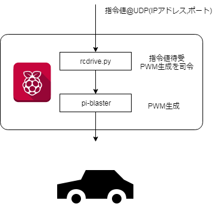


## 概要
ラズパイでタミヤの1/10ラジコンをリモート制御するためのプログラムです。
アクセル、ステアのPWM指令値をラズパイにUDP経由で投げることで制御することができます。

cpp, ~~simulink~~用のクライアントが各フォルダに入っています。



## プロトコル

メッセージ：「s数値」　ステアリングの指令

メッセージ：「a数値」　アクセルの指令

メッセージ：「p」	　PWM生成器の再起動

数値の目安（ラジコン毎に適合が必要）	

	左      N       右
	0.115	0.14	0.166

    前進    N       後退
	0.12	0.137	0.16


## 構築手順

1. 配線
2. pi-blasterインストール
3. 設定
4. 自動実行登録


## 配線

ラジコンの受信機から配線を抜き、ラズパイと結線する。
(受信機のどっちがアクセルでどっちがステアかは忘れた。)

|  ラジコン  |  RaspberryPi  |
| ---- | ---- |
|  GND(黒)  |  GND(14番)  |
|  ステア(白)  |  GPIO17(11番)  |
|  アクセル（白)  |  GPIO18(12番)  |


PIN OUTの参考

[sarfata/pi\-blaster: PWM on the Raspberry pi \- done properly \(in hardware, stable\)](https://github.com/sarfata/pi-blaster#how-to-use)

配線の手順の参考

[Raspberry Pi 2とタミヤの1/10RCでインターネットラジコンを作ってみた \- Qiita](https://qiita.com/yas-nyan/items/8e358d919c663848b4e6#%E9%85%8D%E7%B7%9A%E7%B7%A8)


## pi-blasterインストール
```
sudo apt-get install debhelper dh-autoreconf dh-systemd dpkg-dev init-system-helpers autoconf
dpkg-buildpackage -us -uc -i && sudo dpkg -i ../pi-blaster*.deb
```

ここに書いてある通り。
[sarfata/pi\-blaster: PWM on the Raspberry pi \- done properly \(in hardware, stable\)](https://github.com/sarfata/pi-blaster#build-your-own-deb-package-and-install-with-dpkg)

社内ネットからアクセスするとプロキシに阻まれることがある。
その場合は以下のコマンドを環境に合わせて書き換え、実行 or ~/.bashrcに追記する。
```
export https_proxy="http://{address}:{port}/"
export http_proxy="http://{address}:{port}/"
export no_proxy="{address},{address}"
```

## 設定と実行
必要に応じてラズベリーパイのIPアドレスを固定しておく。
やり方は調べると大量のでてくるので省略。

rcdriver.pyをダウンロードし適当なフォルダに配置。
制御プログラムの待受ポートはデフォルトで6000番となっているので
変えたい場合は、rcdriver.pyの6行目を書き換える。
```
s.bind(('',6000))
```

実行
```
python {ダウンロードしたフォルダ}/rcdriver.py
```

## 自動起動設定

必要に応じてラズパイ起動時に立ち上がるようにしておく。

/etc/rc.local

このファイルの exit 0よりも手前に以下を追記
```
sudo /home/pi/git/pi-blaster/./pi-blaster
python {ダウンロードしたフォルダ}/rcdriver.py
```

